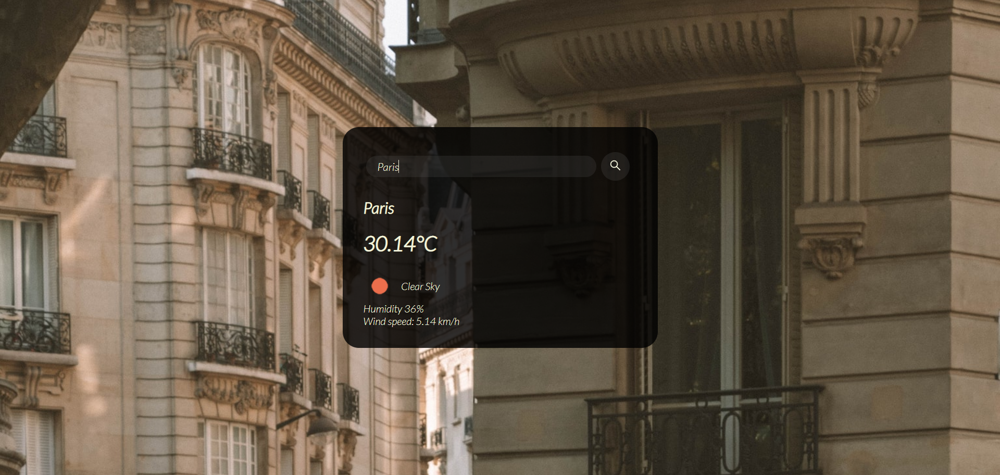
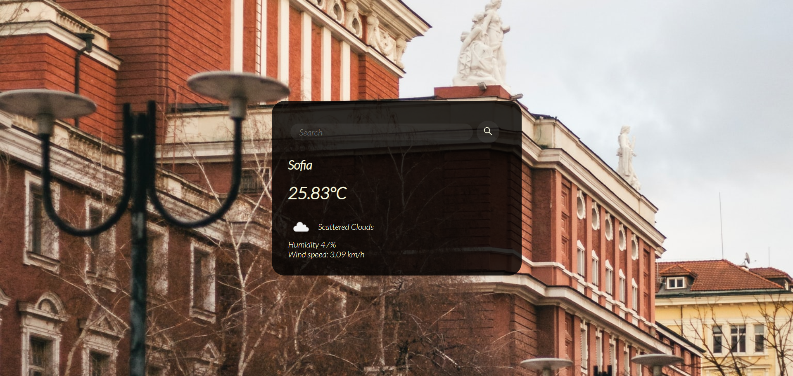

# WeatherApp
This is a simple weather app built with JavaScript.
The information is fetched from the OpenWeatherMap API.
Background images are fetched from Unsplash. 

## Features 
- Search for location 
- Get current information about temperature, weather, humidity etc.
- Background images are updated depending on the current loaction/city

## Screenshots

